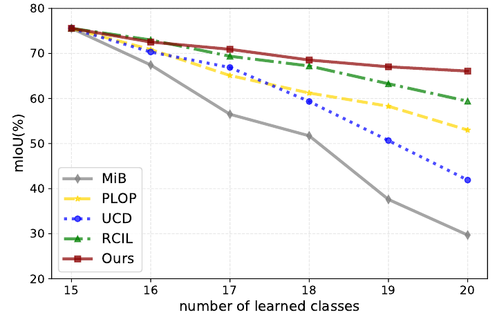
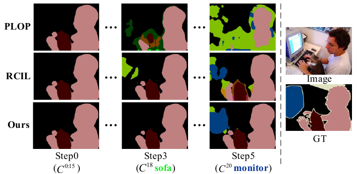
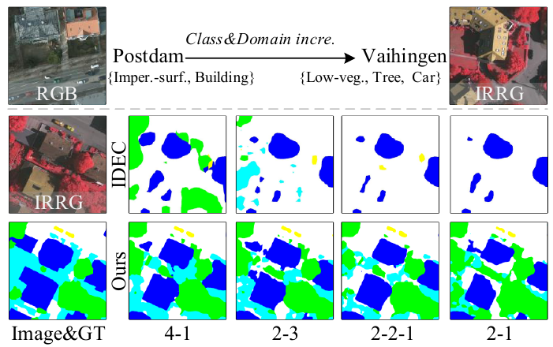

# Learning at a Glance: Toward Interpretable Data-limited Continual Semantic Segmentation via Semantic-Invariance Modeling

## Results
### Class Incremental Learning
Continual learning performance on VOC 15-1.

### Class\&Domain Incremental Learning
ISPRS (Postdam(RGB) to Vaihingen(IRRG))

## Dataset
### Class\&Domain Incre. - ISPRS (Postdam(RGB) to Vaihingen(IRRG))
[link](https://pan.baidu.com/s/1fPiQdPgeSPRasCB84Ru6lw) \
fetch code：`o839` | unzip pwd: `mshwkzwdjl`
Research purpose only

## Models
### Class\&Domain Incre. - ISPRS    
 | task | model |fetch code|
 | :----: | :----: | :----: |
 | 4-1   | [link](https://pan.baidu.com/s/1MpxO9_Vcg0bmv-wUi6omkg) |rsom  |
 | 2-3   | [link](https://pan.baidu.com/s/1QBlBPzomcv8MB3Ao4M8gaA) |5ib6  |
 | 2-2-1 | [link](https://pan.baidu.com/s/1tN4_PRNiidZAuSuD4GsOZQ) |1poz  |
 | 2-1   | [link](https://pan.baidu.com/s/1fSOFsoDghTNHGa82r6ff6Q) |gt7a  |
 
### Class Incre. - VOC
 | task | model |fetch code|
 | :----: | :----: | :----: |
 | 15-5   | [link](https://pan.baidu.com/s/1ABRhmD4SxMFUh1MVxZMS0w) |wc9m |
 | 15-1   | [link](https://pan.baidu.com/s/1J4Rf75_GO5UjnsYmeTr4Lg) |d9mt |
 | 5-3    | [link](https://pan.baidu.com/s/13C4-D8WgnPej1DOQiH0baw) |7lf3 |
 | 10-1   | [link](https://pan.baidu.com/s/1A099wPqKAXMi1yynvDteMw) |j6sg |

## Run
1. Prepare the dataset as introduced in `datasets/ISPRS.py`
2. Inference: Run `python eval.py`
3. Train: Run `python run.py`

## License
©2023 YBIO *All Rights Reserved*

